# Finetuning SAM2 for Adaptive Microwell Segmentation in SPRi

This repo presents an automated image-analysis pipeline for Surface Plasmon Resonance imaging (SPRi), a label-free optical biosensing technique. Given a raw photo of a multiplexed SPRi chip, the pipeline locates every sensing microwell, corrects for camera perspective and illumination, and extracts a per-well intensity signal — replacing the manual, operator-dependent analysis that limits SPRi's use as a real-time diagnostic platform today.

**Paper:** [SSRN](https://papers.ssrn.com/sol3/papers.cfm?abstract_id=6300281)

## Problem

In SPRi, a camera images an entire sensor chip at once, so a microarray of wells can be monitored in parallel instead of one spot at a time. Each well's pixel intensity tracks the refractive index at that spot, which shifts when a target molecule binds — that shift is the biosensing signal we want to measure. Turning a raw chip photo into per-well signal values reliably means solving three problems at once: wells span three physical sizes on the same chip and their apparent size and position shift with camera angle and zoom; illumination is uneven across the chip; and in high-refractive-index conditions, contrast drops to the point where wells are barely distinguishable from background. Manual analysis — hand-picking regions of interest per well, per image — doesn't scale to hundreds of images per experiment, and existing commercial SPR software targets single-spot instruments, not imaging arrays.

## Pipeline

<p float="left">
  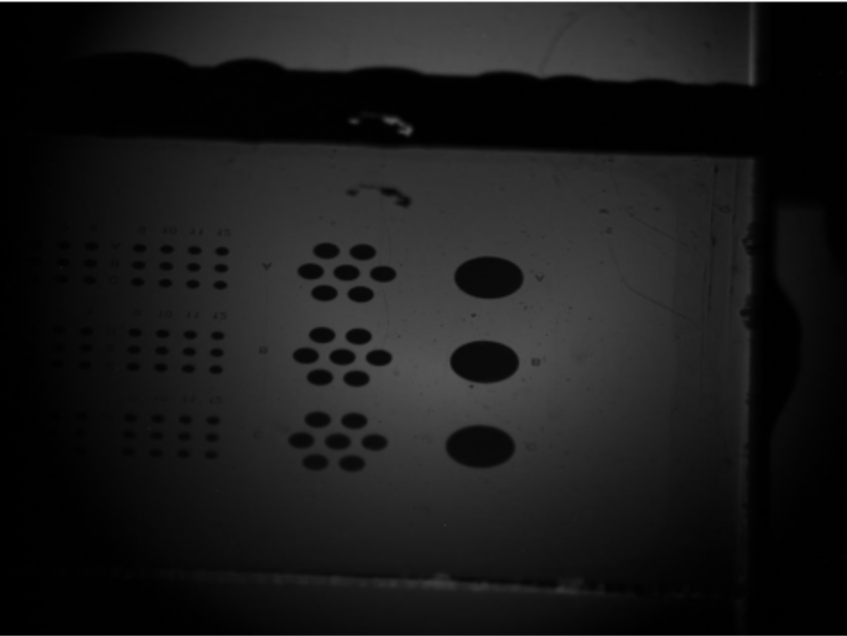
  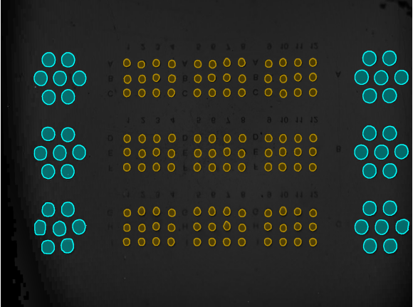
</p>

*The goal: given a raw photo like the one on the left, produce clean, correctly-sized, artifact-free masks like the one on the right — for every well, in every image, unattended.*

Getting there means solving three problems, one per stage below: images are captured at an angle, which distorts well shape and position (**Perspective correction**); classical CV can't reliably find the wells in the first place (**Segmentation**); and automatic segmentation picks up background artifacts along with real wells (**Filtering**).

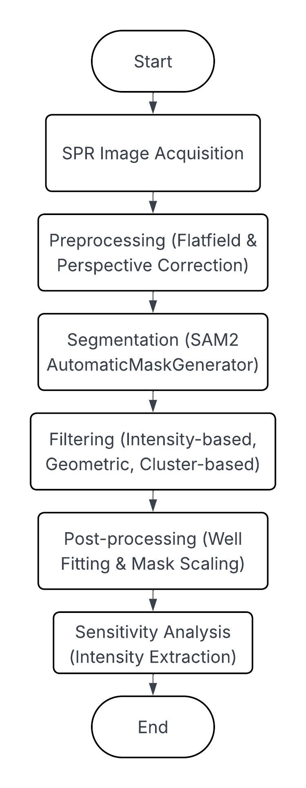

### Perspective correction

This step is needed because of how SPRi acquires images: exciting the plasmon resonance requires illuminating the chip at an angle, so the camera images it at an angle too, not straight-on. This compresses the reflected light into a perspective-distorted image — wells come out elliptical and non-uniformly spaced instead of their true circular, regular layout — so per-well measurements taken this way aren't directly comparable to measurements from any other method applied to the same chip that doesn't share this distortion. Digitally undoing it turned out to be one of the harder problems in the pipeline: standard homography needs ≥4 point correspondences between the distorted image and a reference, but nothing in a raw photo says which well is which. The two-step algorithm (`camera_calibration.py`) solves that: step 1 gets a rough affine alignment from a single reference well's known geometry; step 2 refines it via phase-correlation registration (`imreg_dft`) against the chip schematic.

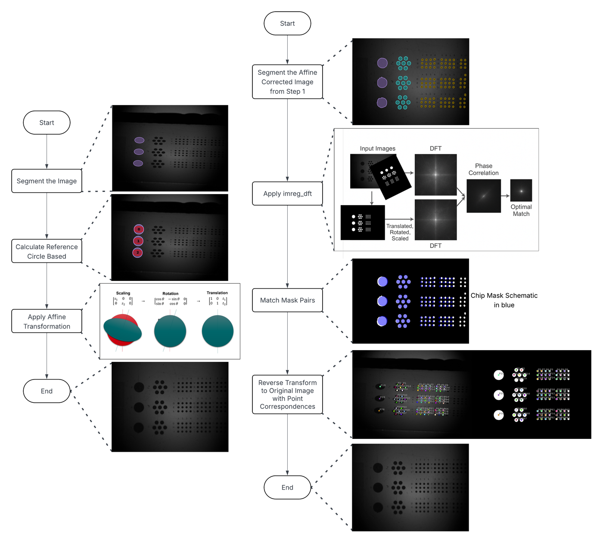

*Step 1: affine approximation from a single reference well. Step 2: phase-correlation registration against the chip schematic.*

Step 1 alone reaches 0.47 IoU against the schematic; step 2 brings it to 0.82:

<p float="left">
  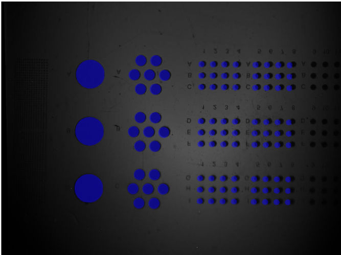
  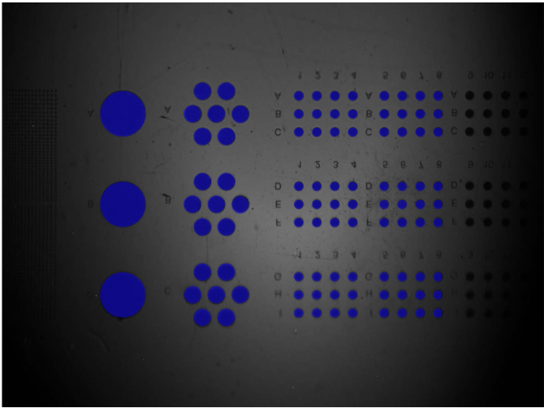
</p>

*Schematic overlay (blue) after step 1 (left, 0.47 IoU) vs. after step 2 (right, 0.82 IoU).*

<p float="left">
  
  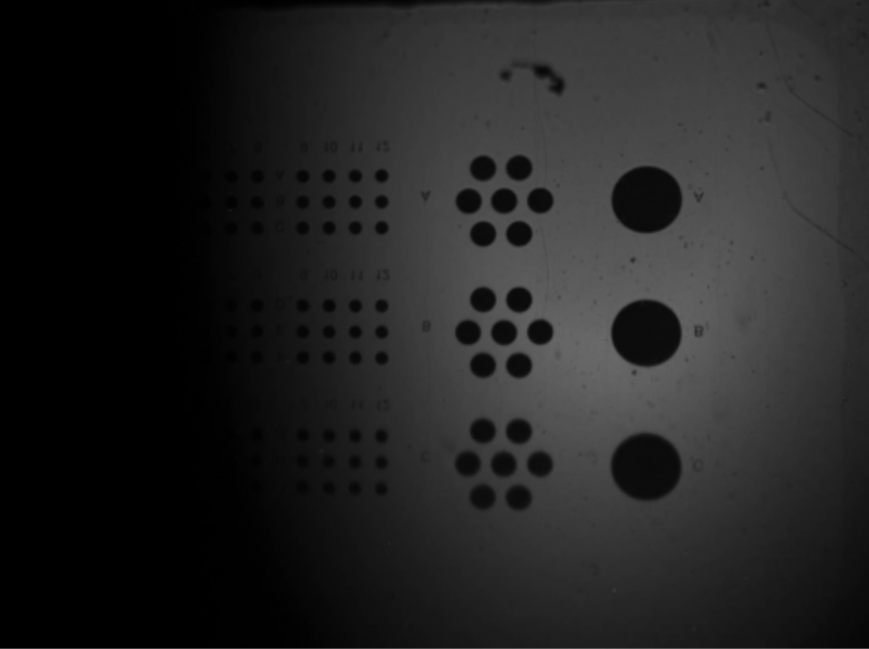
  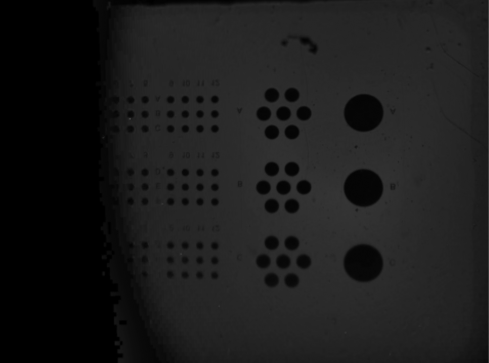
</p>

*Raw image → perspective-corrected → perspective- and flatfield-corrected.*

### Segmentation

Classical CV (blob/edge detection, thresholding) fails outright on SPRi's low-contrast, high-noise images — reliable on easy images, but missing most wells on hard ones. [SAM2](https://github.com/facebookresearch/sam2) was used instead: `SAM2AutomaticMaskGenerator` proposes every plausible mask in one pass with no manual prompting, and is usable zero-shot out of the box. The base model is precise but conservative, though — it misses real wells, especially small ones at low contrast (see [Results](#results)) — so it was finetuned on a small (~100 image, see [Limitations](#limitations)) hand-labelled set to trade some of that precision for better recall, the metric that matters most here: a missed well is unrecoverable downstream, while a false positive can still be caught by filtering (next).

Four finetuning runs were trained (250+ epochs each), one per loss term up-weighted (mask / dice / IoU / class), to see which the model responded to best. Training loss alone can't reveal overfitting on a dataset this small, so `src/finetuning/validation.py` evaluates every checkpoint (saved every 10 epochs) against a held-out validation set instead, and the checkpoint actually used is the one with the best measured validation performance.

### Filtering

This step exists because of how SAM2's promptless segmentation actually works: `SAM2AutomaticMaskGenerator` projects a dense grid of points across the image (128×128 here), uses each point as a prompt, and keeps the most likely mask per prompt based on the model's own quality scores. That reliably finds the microwells, but it also picks up a lot of background noise and artifacts along the way, visible in the raw masks below. Since the signal is measured per detected mask, feeding artifacts into that measurement would directly corrupt the result — so they have to be filtered out before anything is measured. That's not trivial: many artifacts are similar enough to genuine microwells in shape and size that a single filter can't reliably tell them apart, which is why filtering chains circularity → area → duplicate/NMS → border removal before wells are matched to size groups. That last step, grouping by size, isn't hardcoded either: masks are clustered via k-means, run first with k=3 and falling back to k=2 if the resulting groups aren't well-separated by area (some images only capture 2 of the chip's 3 well sizes).

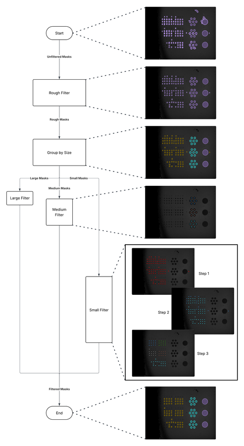

*Filtering pipeline: rough geometric filters, then size-specific clustering per well category.*

<p float="left">
  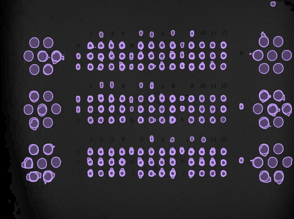
  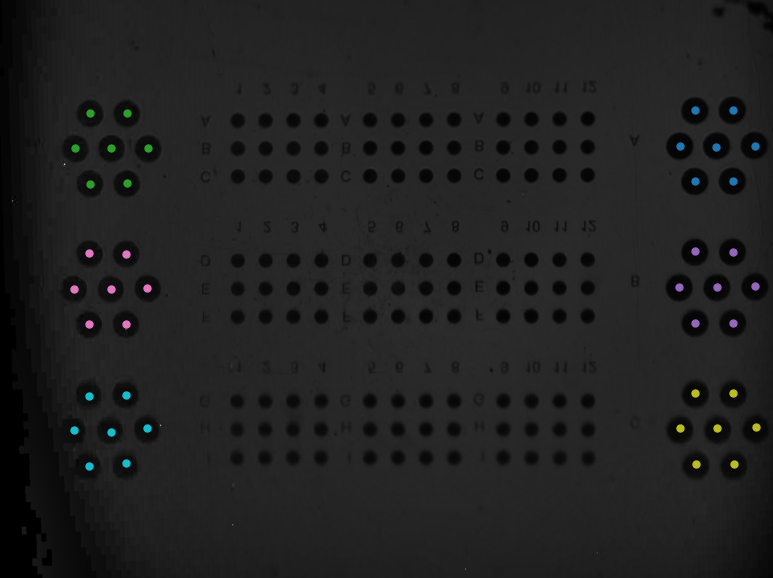
  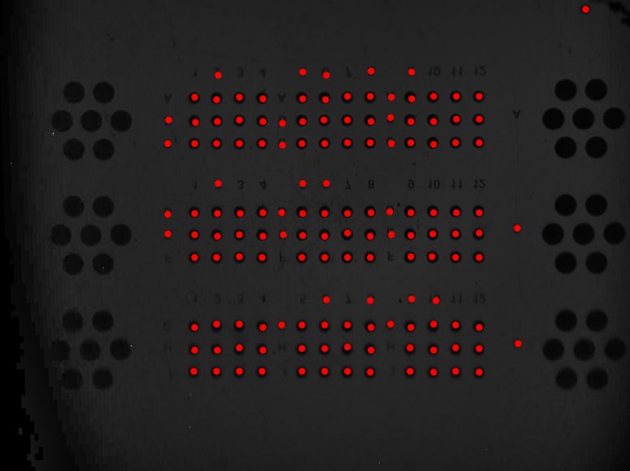
</p>
<p float="left">
  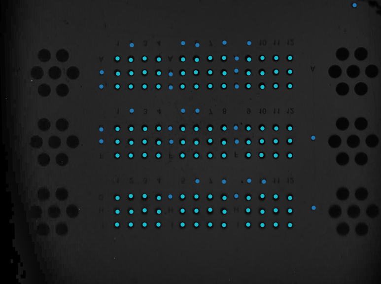
  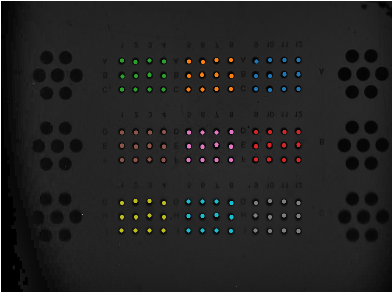
  
</p>

*Unfiltered masks with duplicates → medium-well clustering → small-well artifact exclusion → small-well area clustering → resulting small clusters → final filtered image.*

With clean, correctly-grouped masks, the last step (`src/analysis/analysis.py`) is just extracting per-well pixel intensity, with a 2σ outlier filter to catch anything still spurious. What that's actually worth is below.

## Results

| Model | Recall | Precision | F1 | IoU |
|---|---|---|---|---|
| SAM2 (base, no finetuning) | 0.636 | 0.996 | 0.745 | 0.762 |
| SAM2 — dice loss | 0.756 | 0.911 | 0.795 | 0.747 |
| CellposeSAM (off-the-shelf) | 0.781 | 0.997 | 0.863 | 0.688 |
| SAM2 — class loss | 0.807 | 0.827 | 0.792 | 0.723 |
| SAM2 — mask loss | 0.816 | 0.864 | 0.817 | 0.746 |
| SAM2 — IoU loss | 0.839 | 0.913 | 0.861 | 0.746 |

*Object-level metrics against manually labelled ground truth, sorted by recall — the primary optimization target (see [Segmentation](#segmentation)).*

Finetuning (IoU-loss variant) raises recall from 0.64 to 0.84 — mainly by catching small, low-contrast wells the base model misses — at a precision cost from 0.996 to 0.913. Below: base SAM2 vs. the IoU-loss finetune, on the highest (hardest, lowest-contrast) NaCl concentration in the test set.

<p float="left">
  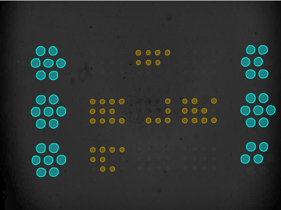
  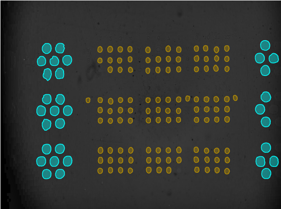
</p>

*Base SAM2 (left) vs. finetuned SAM2-IoU (right), same low-contrast image.*

End to end, the full pipeline (finetuned segmentation + calibration + postprocessing) was validated using NaCl solutions of known concentration as a refractive-index proxy for a real bioassay analyte — a standard calibration approach for RI-based sensors. Compared to raw SAM2 output with no correction, it cuts cross-region variability in calibration slope by 65% and in noise (std. deviation) by 37%, while linearity (R²) stays roughly constant — meaning the sensor behaves consistently regardless of which part of the chip or which camera setup was used, a prerequisite for treating any well on the chip as an equivalent, calibrated sensor.

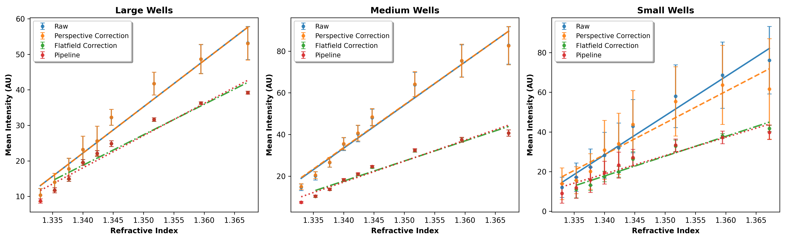

*Calibration curves (intensity vs. NaCl concentration) by well size, comparing pipeline configurations.*

Full quantitative results (per-well-size breakdowns, all four finetuning variants, runtime benchmarks) are in the paper linked above.

## Limitations

- **Never validated on a real bioassay.** A hardware failure partway through the project limited evaluation to the calibration dataset (NaCl solutions as a controlled refractive-index proxy) — the pipeline has not been tested on actual molecular binding data. The calibration improvements are a necessary but not sufficient signal of clinical utility.
- **Small labelled dataset** (~100 images, two chip designs) for finetuning — capped by how many images had stable optical conditions during the camera-calibration phase of data collection, not by labelling effort, and further capped by the hardware failure that cut data collection short before a larger set could be gathered. Unlikely to generalize as-is to a substantially different chip layout without relabelling. Had the system stayed operational, a natural next step would have been repeating the finetuning experiments on a larger dataset, using the already-finetuned model to speed up labelling (propose masks for a human to correct, rather than annotating every well by hand).
- **No finetuning run matched the base model's precision while fixing its recall** — the tradeoff might not be fundamental, but no configuration tried here avoided it.
- **Not real-time**: SAM2 segmentation takes ~10s/image on an H100 GPU (CellposeSAM: sub-second, at lower IoU). Perspective correction (20–90s) only needs to run once per experimental setup, not per image, but full-pipeline throughput is still far from live monitoring.
- **The repo grew organically** — notebooks were written as one-off analysis scripts, not a packaged CLI. `src/` is modular; the notebooks would need to become parametrized scripts to reuse this pipeline as a tool rather than a research artifact.

## Getting Started

1. Install uv, e.g. `pip install uv`
   - if "uv is not recognized ..." error: ensure the correct `<python-installation>/Scripts` path is on `PATH`. Use `pip show uv` to find the install location, then add that path with the last folder replaced by `Scripts`.

2. Create the environment and install dependencies:
   ```
   uv sync
   pip install -e .
   ```

3. Clone and initialize the SAM2 repository (instructions from the [official SAM2 repo](https://github.com/facebookresearch/sam2)):
   ```
   git clone https://github.com/facebookresearch/sam2.git
   cd sam2
   pip install -e .
   ```
   Note: SAM2 refuses to import if Python is later run from this repo's root directory (it shares a name with the cloned `sam2/` folder and detects the collision) — run notebooks/scripts from a subdirectory like `src/` or `notebooks/`, not the repo root.

4. Optional: download SAM2 checkpoints:
   ```
   cd checkpoints && ./download_ckpts.sh && cd ..
   ```

5. Optional: initialize training scripts:
   ```
   cd training && pip install -e ".[dev]"
   ```
